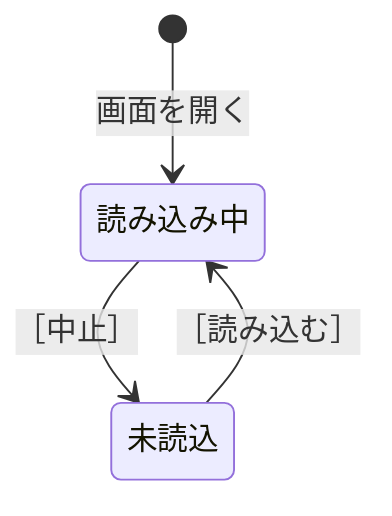

# 仕様は、状態と操作の表で書く

**仕様が漏れるのは、文章で書いたとき。** 表にすると、埋まっていない欄が目に見える。

日本語の書き方は Skill の `writing-ja`。spec-writing には、仕様に固有の手順だけを書く。

---

## 1. 機能ごとにファイルを分け、共通の約束を 1 本化する

**共通の約束を 1 つのファイルに集め、機能のファイルには書き写さない。**
2 箇所に書くと、片方だけ直したときに食い違う。

書く順序は、**あとのファイルが前のファイルを前提にする順**にする。

1. 全画面に共通する約束（一覧の振る舞い、確認の出し方、失敗の見せ方、表記）
2. すべての機能の前提になるもの（接続など）
3. 個別の機能

---

## 2. 状態を洗い出す

**「〜している最中」と「〜し終わった」を分ける。** 混ぜると、押せるボタンが決まらない。

```
✗ 切断された
    （再接続を試している最中と、次の試行を待っている間が混ざる。
     試している最中に「今すぐ再接続」を出してしまう）
○ 再接続待ち / 再接続中
```

次の観点で、抜けを探す。

| 観点 | 例 |
| --- | --- |
| 始める前 | 未起動 |
| 始めている最中 | 起動中 |
| 終わった（成功） | 接続済み |
| 終わった（失敗） | 接続不可 |
| **利用者が止めた後** | 中止した後の状態を必ず決める |
| 待っている間 | 再接続待ち |
| **対象が複数あるとき、対象ごとの状態** | 動作中・未接続 |

### 状態の名前は「〜中」の形の短い名詞にする

```
✗ 接続している最中    ○ 接続中
✗ エンジンが停止している  ○ 停止中
```

**すでに終わったものを「〜中」にしない。**

```
✗ 終了中（いま終了の処理をしている、と読める）
○ 正常終了 / 異常終了
```

### 粒度の違う状態に、同じ名前を付けない

**1 つの機能に、状態の集合が 2 つ以上出てくることがある。**
集合が違えば別の名前にする。

```
✗ 層の状態に「取得済み」、画面の行の状態にも「取得済み」
    （本文で「取得済みになったら」と書いたとき、どちらか読めない）
○ 層は「取得済み」、行は「取得完了」
```

**状態の集合が 2 つ出てきたら、違いを説明する節を 1 つ置く。**
どちらがどちらを含むのかを書く（「層がすべて展開済みになった時点で、行が取得完了になる」）。

---

## 3. 状態・表示する内容・ボタンの 3 列で書く

| 状態 | 表示する内容 | ボタン |
| --- | --- | --- |
| 接続中 | エンジンの名前、実行しているコマンド、経過した時間 | ［中止］ |
| 接続済み | エンジンの名前 | ［停止］ |

**表示する内容とボタンを同じ欄に混ぜない。** 列を分けると、
**ボタンの列を縦に読むだけで、どの状態で何が押せるかが分かる。**

### ボタンが表の外にあってはいけない

```
✗ ［切り替える］の説明が本文にだけあり、状態の表のボタンの列に出てこない
○ ［切り替える］を持つ状態を、表に行として入れる
```

**why: 読む人は表を見て仕様を把握する。** 表に無いボタンは、
節を全部読まないと見つからない。

---

## 4. 操作を書いたら、操作の後の状態を書く

```
✗ ［中止］を押すと、接続をやめる
○ ［中止］を押すと、エンジンが動いていなければ「停止中」、
   動いていれば「動作中・未接続」になる
```

**行き止まりの状態を作らない。** 次に進むボタンが無い状態に落とす仕様は誤り。

```
✗ ［中止］を押すと「接続不可」になる
    （中止しただけなのに、あとから接続する手段が無くなる）
```

### 状態ごとに、きっかけを書く

**状態ごとに「どうやってその状態になるか」も書く。** 表示する内容だけを書くと、
状態がいつ起きるのかを、読む人が組み立てることになる。

```
✗ | 未読込 | 空 | ログを読み込んでいません | ［読み込む］ |
○ 状態の表に加えて、きっかけの表を置く
  | 未読込 | 「読み込み中」で ［中止］ を押した |
```

きっかけが 1 つも書けない状態は、**そもそも起きない状態**かもしれない。
書き出すことで、要らない状態に気づける。

### 状態が 5 つを超えたら、状態遷移図を描く

表では「どの状態から来たか」を書けない。Mermaid を Markdown に埋めると、
GitHub 上で図として表示される（VS Code のプレビューには拡張機能が要る）。

````

````

**図にすると、どこからも行けない状態と、どこへも行けない状態が目で見つかる。**
表では、行を 1 つずつ追って確かめることになる。

---

## 5. 「提供しない」と決める前に、「確認を挟む」で足りないか考える

```
✗ エンジンを停止すると外のコンテナも止まるので、停止する機能は作らない
○ 停止する前に、止まるコンテナの名前を並べて確認する
```

**影響が大きいことは、機能を削る理由ではなく、確認を出す理由。**
同じ理屈で機能を削ると、削除のように確認付きで提供している機能と整合しなくなる。

---

## 6. 対象が複数あることを前提にする

エンジンもコンテナも複数ある。**表示には必ず対象の名前を入れる。**

```
✗ Docker は停止しています
○ colima は停止しています
```

**表示が 2 行以上になる場合は、どの行にどの対象を出すかを決める。**
同じ対象を 2 行に出すと、別のものが 2 つあるように見える。

### 処理中のものに、専用の領域を作らない

**「処理している最中のもの」を出すために画面の領域を増やすと、
同じ対象が領域と一覧の両方に並ぶ。**

```
✗ 取得しているイメージを出す領域を、一覧の上に置く
    （取得しているイメージが 2 箇所に出て、別のものが 2 つあるように見える）
○ 一覧の行にアイコンと進み具合を出し、行の中にボタンを置く
```

**処理が終われば普通の行になるものは、最初から一覧の行として出す。**
領域を分けてよいのは、一覧の 1 行に収まらない中身を出すとき
（領域を分けるときは、どこに出すかを決めて 1 箇所にする）。

---

## 7. 画面に出す文と、仕様の中の名前を分ける

| 仕様の中の名前 | 画面に出す文 |
| --- | --- |
| 接続中 | colima に接続しています… |
| 停止中 | colima は停止しています |

**名前は短い名詞、画面に出す文は利用者が読む日本語。**
混ぜると、名前を変えるたびに画面の文まで変わる。

---

## 8. 事実を推測で書かない

待ち時間・既定値・状態の意味は、**実行するか、一次情報で確かめてから書く。**

```
✗ 停止は既定で 10 秒待つ
○ 待ち時間の既定はエンジンが決めていて、Linux のコンテナでは 10 秒
```

**確かめられなかったものは、確かめられなかったと書く。**
確度が他より低いことを隠すと、実装する人が確かめ直す機会を失う。

---

## 9. 待たせる箇所の書き方を揃える

利用者を待たせる状態が複数あるなら、**出す項目と並びを 1 つに決める。**

```
✗ 探索中は「（… を実行中）」、起動中はコマンドだけ
○ どちらも「対象の名前 → 何をしているか → 実行しているコマンド → 経過した時間」
```

**揃える規則を 1 箇所に書き、各状態の説明には書き写さない。**

---

## 10. 当然の疑問に先回りする

**その機能について読む人が最初に思うことに、答えているか。**

```
✗ 絞り込み: 入力した文字を含む行だけを出す
○ 対象は画面が保持している行だけか。解除したら絞っている間の行は読めるか。
   絞っている間も新しい行は届くか。大文字と小文字を区別するか
```

答えていない仕様は、**実装する人が自分で決めることになる。**

### いちばん先に来る疑問は、「その機能は何のためにあるか」

**振る舞いから書き始めない。** 読む人が最初に思うのは、進捗の出し方でも失敗の見せ方でもなく、
**そのボタンを押す場面が何か。**

```
✗ 「取得」の節を、進捗の出し方から書き始める
○ 「コンテナを起動するだけなら、取得の操作は要らない。
    取得のボタンが要るのは、同じタグの新しいイメージに入れ替えるとき」を先に書く
```

**要る場面を書けない機能は、要らない機能かもしれない。**
規則 5（「提供しない」と決める前に、「確認を挟む」で足りないか考える）の逆で、
**場面を書き出すことで、入れる必要の無い機能に気づける。**

---

## 11. 画面の図は、全行の表示幅をそろえる

画面の構成と確認の表示は、枠線（`┌─│└`）の図で書く。
**枠の中の全行が同じ表示幅でないと、枠が崩れて配置が読めなくなる。**

**幅は `scripts/check_spec.py` で確かめる。** 手で数えない。

```
python3 <spec-writing のディレクトリ>/scripts/check_spec.py --font <図を読むフォント.ttf> <仕様のファイル…>
```

| 渡すもの | 幅の求め方 |
| --- | --- |
| `--font` あり | フォントの字の幅から求める。利用者が図を読むフォントが分かっているなら、必ず渡す |
| `--font` なし | Unicode の East Asian Width から求める（`W` `F` `A` が 2 列、それ以外が 1 列） |

**why: East Asian Width の判定は、フォントの実際の幅と食い違うことがある。**
判定が 1 列でもフォントでは 2 列の記号があり、逆もある。
フォントにグリフが無い字は別のフォントに置き換わり、1.51 列のような半端な幅になるので、
どちらの数え方でも揃わない。スクリプトは、グリフが無い字を「幅の分からない字」として報告する。
「幅の分からない字」は、図から外すか、ブラウザでフォントを指定して実際の幅を測ってから使う。

利用者が図を読むフォントは、プロジェクトの記憶か CLAUDE.md に書いておく。

### 図は配置だけを表す

**色・余白・字の大きさ・アイコンの絵柄を、図で表そうとしない。**
見た目の正は、画面を実際に描いたもの（Storybook など）。

```
✗ コピーのアイコンを図の中にも記号で置く（フォント次第で枠が崩れる）
○ 図の中では ［コピー］ と書き、「画面に出すのは絵のアイコン」と本文に書く
```

**図を画面の写真に差し替えない。** 写真は差分が読めず、古くなっても気づけない。

---

## 書いた後の点検

**状態を 1 つ足したら、直す場所が 3 つある。**

1. 状態の表
2. 表示の例
3. 状態を参照している本文と、別の表

### スクリプトで確かめること

```
python3 <spec-writing のディレクトリ>/scripts/check_spec.py --font <フォント.ttf> <機能のファイル…>
python3 <spec-writing のディレクトリ>/scripts/check_spec.py --font <フォント.ttf> --boxes-only <共通の約束のファイル>
```

- 枠線の図の全行が、同じ表示幅か（規則 11）
- 状態の表に、すべてのボタンが出てくるか（「表に無いボタン」が 0 件か）

**ボタンの点検は、共通の約束のファイルには当てない（`--boxes-only`）。**
共通の約束のファイルは他の機能のボタンを例として引くので、
「表に無いボタン」が必ず残る。ボタンの持ち主の機能のファイルで当てる。

### 読んで確かめること

次の順に当てはめる。

1. **画面の枠にあるボタンが、どの状態で押せるかを書いてあるか**
2. **行き止まりの状態が無いか**（次に進むボタンがあるか）
3. **どの状態にも、その状態に至るきっかけが書いてあるか**
4. 表示の例が、状態の表と**同じ順で、同じ数だけ**並んでいるか
5. 「N つの状態のとき」のような**数を書いた文が、古くなっていないか**
6. **既定で出さないと決めたものについて、出す前提の規則を書いていないか**
7. 同じ規則を **2 箇所に書いていないか**（1 箇所に集めて、残りは参照にする）
8. 対象の**名前が表示に入っているか**
9. 当然の疑問に答えているか

### 「どの状態で押せるか」は、スクリプトを通っても見つからない

**「表にすべてのボタンが出ている」と「どの状態で押せるかが書いてある」は別のこと。**

```
✗ ［閉じる］が画面の構成の表にあるので、「表に無いボタン」は 0 件になる。
   しかし状態の表のボタンの列が「無し」の状態があり、**何も押せないように読める**
○ 「［閉じる］は、どの状態でも押せる。見出しにあり、状態によって消えない」と書く。
   状態の表のボタンの列も「無し（見出しの ［閉じる］ は押せる）」にする
```

**状態遷移図にすべての矢印を書くと図が読めなくなる場合は、図から外して注記で書く。**
外したことも書く——書かないと、図に無い遷移が「できない」と読める。

### 「出す前提の規則」は、既定を変えたときに嘘になる

```
✗ 「タグの無いイメージは既定で隠す」と書きながら、
   並び順の節で「タグの無いイメージは一番後ろにまとめる」と書く
    （既定では出てこないものの位置を決めていることになる）
○ 既定を変える（出す）か、「設定で出すようにした場合は」と条件を書く
```

---

## やりがちな失敗

**同じ規則を複数の節に書く。** 表示の書き方を 3 箇所に散らすと、片方だけ直る。

**状態を足したのに、状態を数えた文を直さない。**
「6 つの状態のとき」と書いた文は、状態が増えたときに嘘になる。
**数で書かず、条件で書く**と古くならない。

**状態ごとの一覧を、規則で置き換えられないか考えない。**
「どの状態で出すか」を状態の数だけ並べるより、
「1 行目に名前が出ていないものを出す」と規則で書くほうが、状態が増えても正しいままになる。

**利用者が読む言葉を決めずに書く。** 状態の名前をそのまま画面に出すと、
「接続不可」のような、利用者が次に何をすればよいか分からない表示になる。

**「成功は知らせない」を、結果が見えない場面にも当てはめる。**
共通の約束で「成功は一覧の表示が変わることで分かる」と決めていても、
**表示が何も変わらない成功がある**（すでに最新だったイメージの取得など）。
共通の約束を当てはめる前に、**表示が本当に変わるかを確かめる。**
