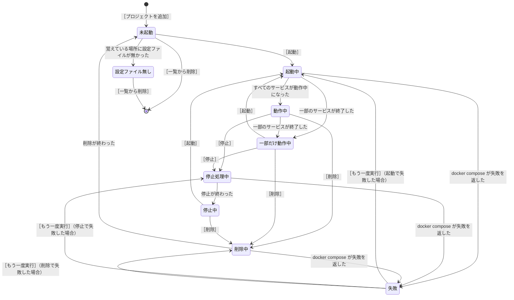

# 仕様: Compose

`common.md` の約束を前提にする。

## Compose とは

**複数のコンテナをまとめて起動・停止する仕組み。**
起動するコンテナとコンテナの設定を 1 つのファイル（`docker-compose.yml`）に書き、まとめて扱う。

| 言葉 | 意味 |
| --- | --- |
| **プロジェクト** | 設定ファイル 1 つ分のまとまり。名前は、設定ファイルが置かれたフォルダの名前 |
| **サービス** | プロジェクトの中の、コンテナ 1 つの定義。名前は `web` `db` など |
| **設定ファイル** | `docker-compose.yml`。サービスの一覧と、サービスごとの設定を書く |

**Compose の操作は Engine API に無い。**
DockerGUI は `docker compose` のコマンドを子プロセスで実行する（`design-policy.md`）。
コンテナ・イメージ・ボリューム・ネットワークの画面とは、Docker への頼み方が違う。

## 画面の構成

```
        ┌────────────────────────────────────────┐
見出し  │ [絞り込み        ]                         ［プロジェクトを追加］              │
        ├────────────────────────────────────────┤
一覧    │ cypher-quiz     動作中           3 / 3   ~/projects/cypher-quiz                │
        │ shop-api        一部だけ動作中   1 / 2   ~/projects/shop-api                   │
        │ batch-jobs      停止中           0 / 4   ~/projects/batch-jobs                 │
        │ old-tool        未起動           0 / 2   ~/projects/old-tool                   │
        └────────────────────────────────────────┘
```

| 部分 | 位置 | 出すもの |
| --- | --- | --- |
| 見出し | 一番上 | 絞り込みの入力、［プロジェクトを追加］ |
| 一覧 | 見出しの下 | プロジェクトの一覧 |

## 一覧

### 出す列

| 列 | 内容 |
| --- | --- |
| 名前 | プロジェクトの名前 |
| 状態 | 「プロジェクトの状態」のとおり |
| サービス | 動作中のサービスの数 / サービスの数 |
| 設定ファイル | 設定ファイルの場所。長ければ中央を省略する（`common.md` の「長い名前」） |

### 起動していないプロジェクトを、Compose は知らない

**`docker compose ls` は、動作中のコンテナがあるプロジェクトしか返さない**（開発機で確認）。

| 実行するもの | 返るプロジェクト |
| --- | --- |
| `docker compose ls` | **動作中のコンテナがある**プロジェクトだけ |
| `docker compose ls -a` | 停止したコンテナだけのプロジェクトも含む |

**`down` でコンテナを削除すると、プロジェクトは `-a` を付けても返らなくなる**（開発機で確認）。

**そのため、DockerGUI は設定ファイルの場所を自分で覚える。**
一度でも一覧に出たプロジェクトと、利用者が ［プロジェクトを追加］ で選んだプロジェクトを、
設定ファイルの場所とあわせて保存する。

**why: 覚えないと、`down` したプロジェクトを DockerGUI から起動できなくなる。**
利用者は、ターミナルでフォルダへ移動して `docker compose up` を打つことになる。

### プロジェクトを追加する

［プロジェクトを追加］ を押すと、ファイルを選ぶ画面が出る。設定ファイルを選ぶと一覧に追加する。

#### 追加しただけでは起動しない

**追加したプロジェクトは「未起動」で一覧に並ぶ。** 起動するには ［起動］ を押す。

**why: 追加は、1 つのプロジェクトにつき 1 回きりの操作。**
DockerGUI が速くする対象は毎日繰り返す操作なので（`overview.md` の「誰が、どの場面で使うか」）、
1 回きりの操作で手数を削る価値は小さい。

**why: 起動は取り消しにくい。** イメージの取得を伴うと分を単位で待たされ、
片付けるには ［削除］ が要る。

**why: ファイルを選ぶ画面では、選び間違いが起きる。**
設定ファイルの名前はどのプロジェクトでも `docker-compose.yml` なので、
**別のフォルダのものを選んでも、名前では気づけない。**
自動で起動すると、間違いに気づくのが起動し終わった後になる。

**why: すでに動作中のプロジェクトを追加したときに、何をするか決められない。**
自動で起動する仕様だと、`up` を実行するのか何もしないのかを決めることになる。

#### 追加した行を、選んだ状態にする

**追加した行を選んだ状態にして、画面に見えるところまで動かす。**

| 選んだ設定ファイル | 一覧の変化 |
| --- | --- |
| 一覧に無いもの | 行を追加し、**追加した行を選んだ状態にする** |
| **すでに一覧にあるもの** | **行を増やさず、すでにある行を選んだ状態にする** |

**why: 追加した行は、名前の順に並ぶので一覧のどこに入るか分からない。**
選んだ状態にしないと、利用者は追加できたかどうかを一覧から探して確かめることになる。
**行が見えれば、そのまま ［起動］ を押せる。**

**行を増やさない why: 同じプロジェクトが 2 行に出ると、別のものが 2 つあるように見える。**

#### すでに一覧にある設定ファイルを選んだとき

**すでに一覧にあることを、知らせの画面で出す。**

```
┌──────────────────────────────────────────┐
│ ~/projects/cypher-quiz/docker-compose.yml は、すでに一覧にあります。               │
│ プロジェクト cypher-quiz の行を選択しました。                                      │
│                                                            [ 閉じる ]              │
└──────────────────────────────────────────┘
```

- **選んだ設定ファイルの場所を出す。** どのファイルが重なったのかを、利用者が確かめられる
- **すでにある行のプロジェクトの名前を出す。** 設定ファイルの場所とプロジェクトの名前は別物で、
  **名前を出さないと、一覧のどの行と重なったのか分からない**
- **行を選択したことを表示する。** 画面の後ろで行が選ばれているので、閉じた後に何を見ればよいか伝わる

**why: 行が増えないときは、一覧の表示がほとんど変わらない**（選んだ行が変わるだけ）。
知らせないと、何も起きなかったように見える（`common.md` の「表示が変わらない成功は、知らせる」）。

**知らせであって、失敗ではない。** 利用者が求めた状態（プロジェクトが一覧にある）には、すでになっている。
文面に「できませんでした」と書かない。

### プロジェクトの状態

`docker compose ls -a --format json` の `Status` は、状態と件数を並べた文字列（開発機で確認）。

| `Status` の例 | 画面に出す言葉 |
| --- | --- |
| `running(3)` | 動作中 |
| `exited(1), running(1)` | 一部だけ動作中 |
| `exited(2)` | 停止中 |
| プロジェクトが返らない | 未起動（DockerGUI が覚えているだけ） |

**`Status` の文字列をそのまま出さない。** 英語で、件数の書き方も Docker の都合で決まっている。

### 並び順

**動作中のプロジェクトを先に出し、動作中のプロジェクトの中では名前の順に並べる。**
`containers.md` の並び順と同じ考え方——一覧を開く目的の多くは、いま動作中のものを見ることにある。

### 絞り込み

プロジェクトの名前と、設定ファイルの場所の両方を対象にする。

**why: 同じ名前のプロジェクトが増える。** プロジェクトの名前はフォルダの名前なので、
`app` のようなよくある名前が別の場所に何個もできる。場所で絞れないと見分けられない。

### 1 件も無いとき

```
Compose のプロジェクトが 1 件もありません
［プロジェクトを追加］を押して、docker-compose.yml を選択してください
```

## 詳細

一覧の行を選ぶと、プロジェクトの詳細とサービスの一覧を出す。

| 項目 | 内容 |
| --- | --- |
| プロジェクト | プロジェクトの名前。［コピー］ を置く |
| 設定ファイル | 設定ファイルの場所。全体を出し、［コピー］ を置く |
| サービスの一覧 | 「サービスの一覧は、停止したコンテナも出す」のとおり |

**設定ファイルの場所は、詳細では省略せずに全体を出す。**
ターミナルで `cd` するときに使うので、途中までのパスでは役に立たない。


```
┌──────────────────────────────────────────┐
│ プロジェクト   cypher-quiz                                   ［コピー］            │
│ 設定ファイル   ~/projects/cypher-quiz/docker-compose.yml     ［コピー］            │
│                                                                                    │
│ サービス   コンテナ              状態       イメージ    ポート                     │
│ web        cypher-quiz-web-1     動作中     node:22     8080 → 3000               │
│ neo4j      cypher-quiz-neo4j-1   動作中     neo4j:5     7474 → 7474               │
│ seed       cypher-quiz-seed-1    正常終了   node:22                                │
└──────────────────────────────────────────┘
```

**サービスの状態の呼び方は、`containers.md` の「状態の呼び方」と同じ。**
サービスの実体はコンテナなので、別の呼び方を作らない。

### サービスの一覧は、停止したコンテナも出す

**`docker compose ps` は動作中のコンテナしか返さない。`-a` を付けると終了したコンテナも返る**
（開発機で確認）。DockerGUI は `-a` を付ける。

**why: 終了したサービスこそ見たい。** 起動に失敗したサービスが一覧から消えると、
利用者には「サービスが足りない」としか見えない。

### サービスからログとターミナルを開く

サービスの行から、ログの画面とターミナルの画面を開く。
開ける状態と仕様は `containers.md` の「ログとターミナルを開く」と同じ。

## 操作

| 操作 | 押すボタン | 出す状態 | 実行するもの | 確認 |
| --- | --- | --- | --- | --- |
| 起動 | ［起動］ | 未起動、停止中、一部だけ動作中 | `up -d` | 無し |
| 停止 | ［停止］ | 動作中、一部だけ動作中 | `stop` | 無し |
| 削除 | ［削除］ | 未起動以外 | `down` | **有り** |
| ボリュームごと削除 | ［ボリュームごと削除］ | 未起動以外 | `down --volumes` | **有り** |
| 一覧から削除 | ［一覧から削除］ | **未起動、設定ファイル無し** | 実行しない | **有り** |

### 停止と削除は違う

**利用者が最も間違えやすいところなので、ボタンの文と確認の文で書き分ける。**

| | コンテナ | ボリューム（データ） | もう一度起動できるか |
| --- | --- | --- | --- |
| **停止**（`stop`） | 残る | 残る | できる |
| **削除**（`down`） | **消える** | 残る | できる（作り直す） |
| **ボリュームごと削除**（`down --volumes`） | **消える** | **消える** | できる（データは戻らない） |

```
┌──────────────────────────────────────────┐
│ プロジェクト cypher-quiz を削除します。                                            │
│ コンテナとネットワークが消えます。ボリュームは残ります。                           │
│ 元に戻せません。                                                                   │
│                                        [ やめる ]  [ 削除する ]                    │
└──────────────────────────────────────────┘
```

```
┌──────────────────────────────────────────┐
│ プロジェクト cypher-quiz を、ボリュームごと削除します。                            │
│ コンテナとネットワークに加えて、ボリュームの中のファイルも消えます。               │
│ 消えるボリューム: cypher-quiz_neo4j-data、cypher-quiz_node-modules-api             │
│ 元に戻せません。                                                                   │
│                              [ やめる ]  [ ボリュームごと削除する ]                │
└──────────────────────────────────────────┘
```

**ボリュームごと削除の確認には、消えるボリュームの名前を全部並べる**（`common.md`）。

### 一覧から削除する

**コンテナが 1 つも無いプロジェクト**（「未起動」と「設定ファイル無し」）には、
［削除］ の代わりに ［一覧から削除］ を出す。
**DockerGUI が覚えている場所を忘れるだけで、Docker には何も頼まない。**

**why: コンテナが無いプロジェクトに `down` を実行しても、何も起きない。**
押しても何も変わらないボタンを出すと、利用者は失敗したと考える。

```
┌──────────────────────────────────────────┐
│ プロジェクト old-tool を、DockerGUI の一覧から削除します。                         │
│ 設定ファイル ~/projects/old-tool/docker-compose.yml は消えません。                 │
│ ［プロジェクトを追加］ で、もう一度一覧に追加できます。                            │
│                                        [ やめる ]  [ 一覧から削除する ]            │
└──────────────────────────────────────────┘
```

**設定ファイルが消えないことを、確認の画面に表示する。**
「削除」の文字とファイルの場所が並ぶので、書かないと**ファイルが消えると読める。**

**取り返しがつく操作だが、確認を出す。** `common.md` は取り返しのつかない操作に確認を出すと
決めているが、**利用者が取り返しのつかない操作だと読む**なら、確認を出して打ち消す。

## 起動と停止の進み具合

`docker compose` に `--progress json` を付けると、進み具合が **1 行 1 件の JSON** で返る
（開発機で確認）。

```json
{"id":"Container dg-compose-a-1","status":"Working","text":"Starting"}
{"id":"Container dg-compose-a-1","status":"Done","text":"Started"}
```

| 欄 | 中身 |
| --- | --- |
| `id` | `Container <コンテナの名前>`、`Network <ネットワークの名前>`、`Image <イメージの名前>` |
| `status` | `Working`（実行中）、`Done`（終わった）、`Error`（失敗した） |
| `text` | `Creating` `Created` `Starting` `Started` `Pulling` など |

```
┌──────────────────────────────────────────┐
│ cypher-quiz を起動しています…（docker compose up -d）  経過 00:06    ［中止］     │
│   Network   cypher-quiz_default    作成しました                                    │
│   Container cypher-quiz-neo4j-1    起動しました                                    │
│   Container cypher-quiz-web-1      起動しています                                  │
└──────────────────────────────────────────┘
```

**`id` と `text` は英語で返る。** `id` の `Container` `Network` `Image` と、
`text` の語を日本語に置き換えて出す。**置き換えの表に無い語は、返った文字列をそのまま出す**
（`images.md` の「取得の失敗」と同じ扱い）。

**同じ行が 2 回届くことがある**（開発機で確認）。**`id` ごとに 1 行にまとめて、最後の状態を出す。**

## 画面の状態

| 状態 | 表示する内容 | ボタン |
| --- | --- | --- |
| 未起動 | 一覧の行。サービスは `0 / 2` | ［起動］［一覧から削除］ |
| 起動中 | `cypher-quiz を起動しています…（docker compose up -d） 経過 00:06` と、進み具合 | ［中止］ |
| 動作中 | 一覧の行。サービスは `3 / 3` | ［停止］［削除］［ボリュームごと削除］ |
| 一部だけ動作中 | 一覧の行。サービスは `1 / 2` | ［起動］［停止］［削除］［ボリュームごと削除］ |
| 停止処理中 | `cypher-quiz を停止しています…（docker compose stop） 経過 00:03` | ［中止］ |
| 停止中 | 一覧の行。サービスは `0 / 4` | ［起動］［削除］［ボリュームごと削除］ |
| 削除中 | `cypher-quiz を削除しています…（docker compose down） 経過 00:02` と、進み具合 | ［中止］ |
| 失敗 | 失敗の文（`common.md` の「失敗の見せ方」） | ［もう一度実行］［閉じる］ |
| 設定ファイル無し | `~/projects/old-tool/docker-compose.yml が見つかりません` | ［一覧から削除］ |

| 状態 | どうやってその状態になるか |
| --- | --- |
| 未起動 | ［プロジェクトを追加］ で追加した。または、削除してコンテナが無くなった |
| 起動中 | ［起動］ を押した |
| 動作中 | 起動が終わり、すべてのサービスが動作中になった |
| 一部だけ動作中 | 一部のサービスが終了した。または、一部だけ起動に失敗した |
| 停止処理中 | ［停止］ を押した |
| 停止中 | 停止が終わった。または、すべてのサービスが自分で終了した |
| 削除中 | ［削除］ または ［ボリュームごと削除］ を押して、確認で進めた |
| 失敗 | 「起動中」「停止処理中」「削除中」で、`docker compose` が `{"error":true,"message":"…"}` を返した |
| 設定ファイル無し | 覚えている場所に設定ファイルが無かった |



**状態遷移図に書いていない矢印がある。**「起動中」「停止処理中」「削除中」で ［中止］ を押したときと、
「失敗」で ［閉じる］ を押したときは、`docker compose ls -a` で確かめ直した状態へ移る
（「［中止］を押した後」）。確かめ直すまで行き先が決まらないので、図には書けない。

### ［中止］を押した後

**子プロセスを終わらせる。** `docker compose` は途中まで進んでいるので、
**中止した時点の状態を出し直す**（`docker compose ls -a` を実行し直す）。
「失敗」で ［閉じる］ を押したときも、同じように出し直す。

**why: 中止しても、作ったコンテナは残る。** 「起動していない」と決めつけて出すと、
一覧と実際が食い違う。

## 実行するコマンド

| 操作 | コマンド |
| --- | --- |
| プロジェクトの一覧 | `docker compose ls -a --format json` |
| サービスの一覧 | `docker compose -f <設定ファイル> ps -a --format json` |
| 起動 | `docker compose -f <設定ファイル> --progress json up -d` |
| 停止 | `docker compose -f <設定ファイル> stop` |
| 削除 | `docker compose -f <設定ファイル> --progress json down` |
| ボリュームごと削除 | `docker compose -f <設定ファイル> --progress json down --volumes` |

**フォルダを移動しない。** 設定ファイルの絶対パスを `-f` に渡せば、
どこから実行してもプロジェクトの名前は同じになる
（開発機で確認。`-f /tmp/dg-compose/docker-compose.yml` を別の場所から実行しても、
プロジェクトの名前は設定ファイルのあるフォルダの名前 `dg-compose` になった）。

**Windows では、Windows のパスを WSL のパスに直してから渡す。** 変換の手段は `docs/design/windows.md`。

## 失敗の見せ方

`docker compose` は、失敗を同じ JSON の流れで返す（開発機で確認）。

| 返る形 | 意味 |
| --- | --- |
| `{"error":true,"message":"invalid containerPort: notaport"}` | プロジェクト全体が失敗した |
| `{"id":"Image …","status":"Error","text":"Error","details":"pull access denied for …"}` | 1 つの項目が失敗した |

`common.md` の「失敗の見せ方」に合わせて書き換える。

```
cypher-quiz を起動できませんでした。
設定ファイルの ports の書き方が正しくありません（invalid containerPort: notaport）。
~/projects/cypher-quiz/docker-compose.yml を直してから、もう一度起動してください。
```

**Docker が返した英語の文を、括弧に入れて残す。**
利用者が検索するときと、開発者に伝えるときに使う。

## 一覧の更新

コンテナが増減した時点で、プロジェクトの一覧とサービスの一覧を更新する
（設計方針の原則 5）。Compose のコンテナにはプロジェクトの名前がラベルで付くので、
コンテナの増減からどのプロジェクトが変わったか分かる。

**設定ファイルが増えたかどうかは、監視しない。**
DockerGUI は、利用者が ［プロジェクトを追加］ で選んだものと、
コンテナがあるプロジェクトだけを一覧に出す。
