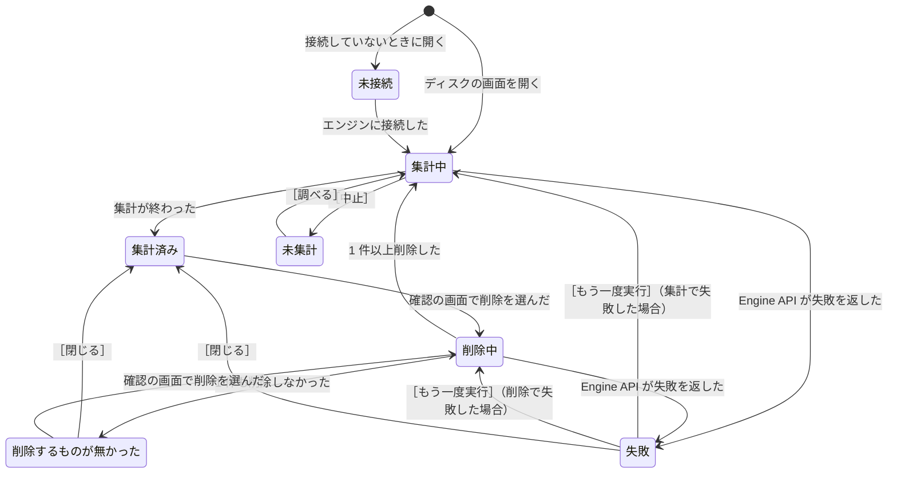

# 仕様: ディスク

`common.md` の約束を前提にする。

## ディスクの画面を使う場面

**Docker が溜めた使われていないデータを消して、ディスクの容量を空ける。**

Docker は、使い終わったデータを自動では消さない。イメージを取得し直すたびに古いイメージが残り、
停止したコンテナも、ビルドの途中の結果も溜まり続ける。
ターミナルで消すには、消すものごとに違うコマンドを打つことになる。

| 消すもの | ターミナルで打つコマンド |
| --- | --- |
| ビルドのキャッシュ | `docker builder prune` |
| 使われていないイメージ | `docker image prune -a` |
| 停止したコンテナ | `docker container prune` |
| 名前の無いボリューム | `docker volume prune` |
| 使われていないネットワーク | `docker network prune` |
| まとめて全部 | `docker system prune -a --volumes` |

**ディスクの画面は、コマンドを覚えていなくても、何がどれだけ容量を使っていて、消すと何 GB 空くかを見せる。**

左の一覧の「ディスク」から開く。

## 言葉

| 言葉 | 意味 |
| --- | --- |
| 使われていないイメージ | どのコンテナからも使われていないイメージ。停止したコンテナが使っているイメージは、使われているものとして数える（`images.md` の「使っているコンテナがあるイメージは、削除できない」） |
| 停止したコンテナ | 動作中と一時停止中以外のコンテナ（開発機で確かめたのは、終了したコンテナが消えることだけ） |
| 名前の無いボリューム | 名前を付けずに作られたボリュームのうち、どのコンテナからも使われていないもの（`volumes-networks.md` の「名前を付けずに作られたボリューム」） |
| 使われていないネットワーク | 動作中のコンテナがつながっていないネットワーク。Docker が最初から持つネットワークは含まない |
| 空けられる大きさ | 削除したときに空くディスクの大きさ |

## 画面の構成

```
        ┌──────────────────────────────────────────┐
見出し  │ colima のディスク                                              ［まとめて削除］    │
        ├──────────────────────────────────────────┤
一覧    │ 種類                        件数    大きさ      空けられる                         │
        │ ビルドのキャッシュ          0 件    0 B         0 B                                │
        │ 使われていないイメージ      3 件    2.1 GB      1.9 GB        ［削除］             │
        │ 停止したコンテナ            2 件    702.6 MB    702.6 MB      ［削除］             │
        │ 名前の無いボリューム        2 件    541.3 MB    541.3 MB      ［削除］             │
        │ 使われていないネットワーク  1 件    —          —            ［削除］             │
        └──────────────────────────────────────────┘
```

| 部分 | 位置 | 出すもの |
| --- | --- | --- |
| 見出し | 一番上 | 接続しているエンジンの名前、［まとめて削除］ |
| 一覧 | 見出しの下 | 消すものの種類ごとに 1 行。件数、大きさ、空けられる大きさ、［削除］ |

**一覧の行は、種類ごとに 1 行で、並びは固定。** 1 件ずつの名前は、削除の確認の画面に並べる。

**why: ディスクの画面で決めたいのは「どの種類を消すか」。** 1 件ずつ選んで消したいときは、
イメージ・コンテナ・ボリュームの画面で行を選んで削除する。

**件数が 0 件の行には ［削除］ を出さない**（`common.md` の「その状態で使えないボタンは、出さない」）。
すべての行が 0 件のときは、［まとめて削除］ も出さない。

### 大きさと、空けられる大きさ

**2 つの数は一致しないことがある。** イメージは層を共有するので、
使われていないイメージが、使われているイメージと同じ層を持っていると、削除してもその層は残る。

| 数 | 求め方 |
| --- | --- |
| 大きさ | 行に入る 1 件ずつの大きさの合計 |
| 空けられる大きさ | `GET /system/df` が返す種類ごとの `Reclaimable`（開発機の Docker 29.5.2、API 1.54 で確認。`ImageUsage` `ContainerUsage` `VolumeUsage` `BuildCacheUsage` のそれぞれに入る） |

ネットワークは大きさを持たないので、大きさの列に `—` を出す。

### 名前の付いたボリュームは、ディスクの画面では消さない

**名前の付いたボリュームは、使われていなくても一覧に入れない。**
消したいときは、ボリュームの画面で 1 つずつ削除する。

**why: 名前の付いたボリュームには、利用者が残すつもりで置いたデータが入っている。**
データベースのデータのように、コンテナを作り直しても引き継ぐために名前を付ける。
「使われていないデータ」とまとめて消すと、消すつもりのなかったデータまで消える。
Docker の CLI も同じ扱いで、`docker system prune --volumes` は名前の無いボリュームだけを消す
（開発機で確認。ヘルプの文は `Prune anonymous volumes`）。

## 画面の状態

| 状態 | 表示する内容 | ボタン |
| --- | --- | --- |
| 集計中 | `colima のディスクの使用量を調べています… 経過 00:02` | ［中止］ |
| 未集計 | `colima のディスクの使用量を調べていません` | ［調べる］ |
| 集計済み | 「画面の構成」の一覧 | 行ごとの ［削除］、［まとめて削除］ |
| 削除中 | `使われていないイメージを削除しています… 経過 00:05`。一覧は削除を始める前の値のまま | 無し（「削除は中止できない」） |
| 削除するものが無かった | `削除できるものがありませんでした` と一覧 | ［閉じる］、行ごとの ［削除］、［まとめて削除］ |
| 失敗 | 失敗の文（`common.md` の「失敗の見せ方」） | ［もう一度実行］［閉じる］ |
| 未接続 | `common.md` の「一覧の状態」の「未接続」と同じ文 | 無し |

| 状態 | どうやってその状態になるか |
| --- | --- |
| 集計中 | ディスクの画面を開いた。または、削除が終わった |
| 未集計 | 「集計中」で ［中止］ を押した |
| 集計済み | 集計が終わった。または、「削除するものが無かった」と「失敗」で ［閉じる］ を押した |
| 削除中 | 確認の画面で [ 削除する ] か [ まとめて削除する ] を押した |
| 削除するものが無かった | 削除が終わり、Engine API が 1 件も削除しなかったと返した |
| 失敗 | 集計か削除で、Engine API が失敗を返した |
| 未接続 | エンジンに接続していないときにディスクの画面を開いた。または、開いている間に接続が切れた |



**接続が切れたときの矢印は、図に書いていない。** どの状態からも「未接続」へ移る。
すべての状態から矢印が出て、図が読めなくなるため。

### 集計は、画面を開いたときだけ行う

**ディスクの使用量は、イベントでは変わらない**（`volumes-networks.md` の「一覧の更新」）。
ディスクの画面を開いたときと、削除が終わったときに `GET /system/df` を呼び直す。

**`/system/df` にどれだけ時間がかかるかは、確かめていない**（`volumes-networks.md` の「大きさは、別に取りに行く」と同じ）。
待たせる処理なので、［中止］ を置く。

### 削除が成功したことは、知らせない

削除が終わると集計し直し、一覧の件数と大きさが変わる。**成功は一覧の表示で分かる**（`common.md` の「結果の知らせ方」）。

**1 件も削除しなかったときだけ、`削除できるものがありませんでした` を出す。**
集計した後に、別の場所で同じものが消されていた場合に起きる。一覧の表示が変わらないので、
知らせないと、削除が動いたのか分からない（`common.md` の「表示が変わらない成功は、知らせる」）。

### 削除は中止できない

**中止のボタンは置かない。** Engine API の削除は、1 回の要求でまとめて消す。
接続を閉じたときにエンジンが削除を続けるかどうかは、確かめていない。
どちらの場合でも、途中で止めると、どこまで消えたかを利用者が確かめられなくなる
（`common.md` の「待たせるときの表示」の例外）。代わりに押せるボタンは無い。

## 削除の確認

**どの行の ［削除］ も、確認を出す**（`common.md` の「取り返しのつかない操作は、確認を挟む」）。
確認の画面には、件数、空く大きさ、消えるものの名前を並べる。

```
┌────────────────────────────────────┐
│ 使われていないイメージ 3 件を削除します。1.9 GB 空きます。             │
│   node:22-slim / neo4j:5-enterprise / alpine:latest                    │
│ 元に戻せません。レジストリにあるイメージは、もう一度取得できます。     │
│                                                                        │
│                                         [ やめる ]  [ 削除する ]       │
└────────────────────────────────────┘
```

| 行 | 確認の画面に並べる名前 | 添える文 |
| --- | --- | --- |
| ビルドのキャッシュ | 並べない。件数と大きさだけ | `次のビルドは、キャッシュが無い分だけ時間がかかります` |
| 使われていないイメージ | イメージの名前とタグ。タグの無いイメージは ID の先頭 12 文字 | `レジストリにあるイメージは、もう一度取得できます` |
| 停止したコンテナ | コンテナの名前 | `コンテナの中に書いたファイルも消えます` |
| 名前の無いボリューム | ボリュームの名前の先頭 12 文字 | `ボリュームの中のファイルも消えます` |
| 使われていないネットワーク | ネットワークの名前 | 無し |

**ビルドのキャッシュに名前を並べない why: キャッシュの 1 件ずつには、利用者が見分けられる名前が無い。**

**停止したコンテナには、Compose のプロジェクトのコンテナも入る。**
削除すると、プロジェクトの状態は「未起動」になる（`compose.md` の「プロジェクトの状態」）。
DockerGUI は設定ファイルの場所を覚えているので、プロジェクトは一覧に残り、Compose の画面からコンテナを作り直せる。

### まとめて削除する

［まとめて削除］ を押すと、すべての行の中身を 1 つの確認で消す。

```
┌────────────────────────────────────────┐
│ colima の使われていないデータを、まとめて削除します。                          │
│ 少なくとも 3.2 GB 空きます。                                                   │
│                                                                                │
│   停止したコンテナ 2 件           cypher-quiz-api / cypher-quiz-neo4j          │
│   使われていないイメージ 5 件     node:22 / node:22-slim / neo4j:5 / …        │
│   名前の無いボリューム 2 件       中のファイルも消えます                       │
│   使われていないネットワーク 1 件                                              │
│   ビルドのキャッシュ 0 件                                                      │
│                                                                                │
│ 名前の付いたボリュームは消えません。                                           │
│ 元に戻せません。                                                               │
│                                                                                │
│                                   [ やめる ]  [ まとめて削除する ]             │
└────────────────────────────────────────┘
```

**消す順序は、コンテナ → ネットワーク → 名前の無いボリューム → イメージ → ビルドのキャッシュ。**

**why: コンテナが使っているものは、コンテナを消すまで消せない。**
停止したコンテナが使っているイメージは「使われている」と数えられるので、イメージを先に消すと残る。
コンテナを先に消せば、そのコンテナだけが使っていたイメージも、同じ操作で消せる。

**そのため、まとめて削除で空く大きさは、行ごとの「空けられる大きさ」の合計より大きくなる。**
確認の画面には、行ごとの合計を「少なくとも」を付けて出す。
確認の画面に並べるイメージには、コンテナを消した後に使われなくなるものも含める。

**一部の種類で失敗しても、残りの種類は削除する**（`containers.md` の「まとめて操作する」と同じ扱い）。
失敗した種類と原因を並べて出す。

### 確認に並べた名前と、実際に消えるものは、ずれることがある

**Engine API に、削除する前に何が消えるかを返す手段は無い**（開発機で確認）。
確認の画面の名前は、DockerGUI がコンテナ・イメージ・ボリューム・ネットワークの一覧から組み立てる。
確認を出してから削除するまでの間に、別の場所でコンテナが作られると、
並べたものの一部が消えないことがある（`images.md` の「削除」で、件数から ［削除］ を押せない状態にしない理由と同じ）。

## 実行する Engine API

| 行 | Engine API | 絞り込み |
| --- | --- | --- |
| ビルドのキャッシュ | `POST /build/prune` | 無し |
| 使われていないイメージ | `POST /images/prune` | `dangling=false`（タグの付いたイメージも消す） |
| 停止したコンテナ | `POST /containers/prune` | 無し |
| 名前の無いボリューム | `POST /volumes/prune` | 無し（`all=true` を付けると名前の付いたボリュームも消えるので、付けない） |
| 使われていないネットワーク | `POST /networks/prune` | 無し |

開発機の Docker 29.5.2（API 1.54）で、次のことを確かめた。

| Engine API | 返るもの |
| --- | --- |
| `POST /containers/prune` | 削除したコンテナの ID の一覧と、空いた大きさ |
| `POST /images/prune` | 外したタグと削除したイメージの一覧、空いた大きさ |
| `POST /volumes/prune` | 削除したボリュームの名前の一覧と、空いた大きさ。`all` を付けないと、名前の付いたボリュームは消えない |
| `POST /networks/prune` | 削除したネットワークの名前の一覧。空いた大きさは返らない |

**ビルドのキャッシュの削除は、確かめていない。** 開発機には buildx が入っておらず、
ビルドのキャッシュが 0 件だった。`POST /build/prune` の返す形は、実装のときに確かめる。
