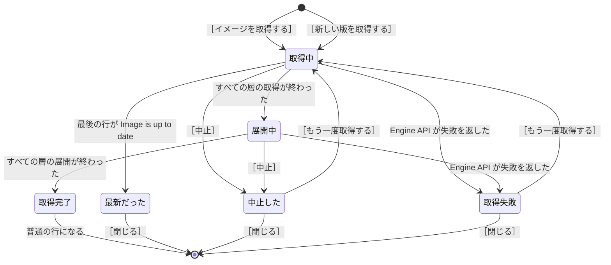

# 仕様: イメージ

`common.md` の約束を前提にする。

**イメージの画面でできるのは、見ることと、取得と、削除の 3 つ。**
起動のボタンは無い——イメージは動くものではない
（`overview.md` の「イメージとコンテナは別のもの」を参照）。

## 画面の構成

画面を 2 つの部分に分ける。

```
        ┌───────────────────────────────────────────┐
見出し  │ [絞り込み     ]   [x] タグの無いイメージも出す        ［イメージを取得する］         │
        ├───────────────────────────────────────────┤
一覧    │   alpine:latest            13.6MB   —               3 か月前                        │
        │ ↓ alpine:3.19                   —   —               取得中 45%          ［中止］  │
        │   neo4j:5                   999MB   コンテナ 1 件   3 週間前                         │
        │ ↓ node:22                  3.27GB   コンテナ 1 件   展開中              ［中止］    │
        │   67d4e34e733a（タグ無し）   541MB   —               3 週間前                       │
        └───────────────────────────────────────────┘
```

| 部分 | 位置 | 出すもの |
| --- | --- | --- |
| 見出し | 一番上 | 絞り込みの入力、タグの無いイメージを出すかの切り替え、［イメージを取得する］ |
| 一覧 | 見出しの下 | イメージの一覧。**取得しているイメージも、同じ一覧に混ぜて出す** |

**取得しているイメージのための領域を、別に作らない。**

**why: 同じイメージが 2 箇所に出る。** 取得の進捗を出す領域を別に作ると、
取得しているイメージが領域と一覧の両方に並び、**別のものが 2 つあるように見える**
（`spec-writing` の規則 6）。
取得が終われば普通の行になるものなので、最初から一覧の行として出す。

## 一覧

### 出す列

| 列 | 内容 |
| --- | --- |
| 名前 | リポジトリ名とタグ（例: `node:22`）。タグの無いイメージはイメージ ID の先頭 12 文字と `（タグ無し）` |
| 大きさ | ディスクの上での大きさ |
| 使っているコンテナ | イメージから作られたコンテナの件数。0 件なら `—` |
| 作成した時間 | イメージが作られてからの経過 |

イメージ ID は、タグの付いたイメージでは一覧に出さない。**名前があるイメージを ID で見分ける利用者はいない**
（`containers.md` のコンテナ ID と同じ扱い）。イメージ ID は詳細の画面に出す。

### タグの無いイメージも、既定で出す

**タグの無いイメージ**とは、リポジトリ名もタグも持たないイメージ。
同じタグで新しいイメージを取得したときと、同じタグでイメージを作り直したときに、
前のイメージからタグが外れて残る。

**Docker CLI の一覧は、タグの無いイメージを既定で隠す**
（開発機の Docker 29.8.0 で確認。`docker images -a` を付けたときだけ出る）。
**DockerGUI は既定で出す。**

**why: 利用者がイメージの画面を開く目的の 1 つは、要らないイメージを削除して容量を空けること。**
タグの無いイメージは、イメージを作り直すたびに増え、
**どのコンテナからも使われないまま容量を占め続ける。**
既定で隠すと、いちばん削除したいイメージが画面に出てこない。

見出しの切り替えを外すと、タグの無いイメージを一覧から隠す。
名前の付いたイメージだけを探すときに使う。

### 取得しているイメージの行

取得しているイメージも、一覧の行として出す。行の状態は「取得しているイメージの行の状態」。

| 取得しているイメージ | 一覧の出し方 |
| --- | --- |
| **手元に無いイメージ** | 行を足す。大きさと使っているコンテナは `—` |
| **すでにある名前のイメージ** | すでにある行にアイコンを出す。大きさと使っているコンテナは、取得の前の値のまま |

**アイコンは、名前の左に出す。**

| アイコン | 意味 |
| --- | --- |
| `↓` | 取得しているイメージ（「取得中」と「展開中」） |
| `!` | 取得が終わらなかったイメージ（「中止した」と「取得失敗」） |

あわせて、**作成した時間の列に取得の進み具合**（`取得中 45%`、`展開中`）を出し、
**行の右に ［中止］** を出す。

**why: 取得の前の値を残す。** すでにあるイメージを取得し直している間も、
利用者はそのイメージから作ったコンテナを動かし続けられる。
大きさと使っているコンテナを空にすると、動いているものが消えたように見える。

**取得を始めた行は、一覧の並びから外さない。** 名前の順のまま、元の位置に置く
（`common.md` の「メニューを開いている間は、並び順を変えない」と同じ理由——行が動くと、
利用者は意図しない行を操作する）。

### 並び順

**名前の順に並べ、タグの無いイメージは一番後ろにまとめる。**

**why: タグの無いイメージは、名前の列に ID が出る。** ID を名前と混ぜて並べると、
探しているイメージの位置が、関係の無い ID の並びでずれる。

見出しの切り替えを外してタグの無いイメージを隠している間は、名前の順だけが残る。

### 絞り込み

リポジトリ名とタグを対象に、入力した文字を含むイメージだけを出す。

### 1 件も無いとき

```
イメージが 1 件もありません
［イメージを取得する］を押すと、レジストリからイメージを取得できます
```

## 詳細

一覧の行を選ぶと、イメージの詳細を出す。

| 項目 | 内容 |
| --- | --- |
| イメージ ID | 全体を出す（`common.md` の「利用者がコピーして使いたい値」） |
| 名前 | **1 つのイメージに 2 つ以上のタグが付くことがあるので、付いているタグを全部並べる** |
| ダイジェスト | レジストリの上でイメージを指す値 |
| 大きさ | ディスクの上での大きさ |
| 作成した日時 | 年月日と時分秒 |
| 使っているコンテナ | コンテナの名前と状態を並べる |
| ラベル | キーと値 |

**取得している最中のイメージの詳細には、層ごとの進み具合を出す**
（「層ごとの進捗は、詳細に出す」を参照）。

### 使っているコンテナの名前は、コンテナの一覧から組み立てる

**Engine API のイメージの一覧は、使っているコンテナの件数しか返さない**
（開発機で確認。`GET /images/json` の `Containers` に件数が入る）。

コンテナの名前を出すには、コンテナの一覧を取り、イメージ ID が一致するコンテナを集める。

## 取得

### イメージを取得する場面

**コンテナを起動するだけなら、取得の操作は要らない。**
イメージが手元に無ければ、エンジンが起動の前に自動で取得する
（開発機で確認。`docker run --pull` の既定は `missing`）。

取得のボタンが要るのは、次の場面。

| 場面 | 自動の取得では足りない理由 |
| --- | --- |
| **同じタグの新しいイメージに入れ替える** | **手元にイメージがあると、エンジンはレジストリを見に行かない。** `node:22` が手元にある限り、レジストリの `node:22` が新しくなっても、古いイメージのまま起動し続ける |
| **起動の前に取っておく** | 取得は分を単位で待たされる。起動と一緒に取得すると、待っている間コンテナが起動しない |
| **通信できるうちに取っておく** | 通信できない場所で作業する前に、要るイメージを揃えておく |

**`docker build` も同じ。** Dockerfile に `FROM node:22` と書いてあっても、
`node:22` が手元にあればレジストリを見に行かない
（開発機で確認。`docker build --pull` は既定で付かない）。

**同じタグを取得し直すと、前のイメージはタグの無いイメージになる。**
タグが新しいイメージに移り、前のイメージは名前を失って残る
（「タグの無いイメージも、既定で出す」を参照）。

### すでにあるイメージを、新しい版に入れ替える

**一覧の行と詳細に ［新しい版を取得する］ を置く。**
押すと、**同じ名前と同じタグで取得を始める。** 名前を入力し直す必要は無い。

| 押すボタン | 出す条件 |
| --- | --- |
| ［新しい版を取得する］ | **タグの付いたイメージ** |
| 出さない | **タグの無いイメージ。** 名前が無いので、レジストリのどのイメージを取るか決められない |

**確認は出さない。** 取り返しのつかない操作ではない（`common.md`）。

#### すでに最新だったとき

**エンジンは、取得の最後の 1 行で、新しいイメージを取得したかどうかを返す**（開発機で確認）。

| 取得の最後の行 | 意味 |
| --- | --- |
| `Status: Downloaded newer image for node:22` | 新しいイメージを取得した |
| `Status: Image is up to date for node:22` | すでに最新だった |

**すでに最新だったときは、画面に知らせる。**

**why: `common.md` は「成功は知らせない。一覧の表示が変わることで分かる」と決めているが、
すでに最新だった場合は一覧の表示が何も変わらない。** 知らせないと、
利用者は取得が動いたのかどうかを判断できない。

#### 新しい版に入れ替わった後

タグが新しいイメージに移り、**前のイメージはタグの無いイメージとして残る**
（「タグの無いイメージも、既定で出す」を参照）。

**前のイメージから作ったコンテナは、前のイメージのまま動き続ける。**
新しい版で動かすには、コンテナを作り直す（Compose のプロジェクトなら、`compose.md` の起動と停止）。

### 入力するもの

［イメージを取得する］を押すと、イメージの名前の入力を出す。

- **タグを省略したら `latest` を補い、補ったタグを入力欄に出す。**
  利用者が、取得を始める前に何を取得するか読めるようにする。
- レジストリ名を省略したら Docker Hub から取得する（Docker の既定に合わせる）。

### レジストリと通信するのは、エンジン

**DockerGUI はレジストリと通信しない。** Engine API に取得を頼むだけで、
レジストリに接続して層を取得するのはエンジン（開発機で確認）。

1. DockerGUI が `POST /images/create?fromImage=alpine&tag=3.19` を呼ぶ
2. **エンジンがレジストリに接続し、層を取得する**
3. エンジンが取得の進み具合を、開いたままの応答に 1 行 1 件の JSON で書き続ける
4. すべての層の展開が終わると、エンジンが応答を閉じる

**取得したイメージは、エンジンの中に保存される。**
macOS と Windows ではエンジンが仮想マシンの中で動くので、
イメージは利用者のパソコンのディスクに直接は置かれない
（`volumes-networks.md` の「置き場所は、利用者のパソコンのパスではない」と同じ）。

**DockerGUI はレジストリを検索しない。** 取得できるイメージの一覧をレジストリから引く手段は作らない。
利用者がイメージの名前を入力する。

### ログインが要るレジストリ

**レジストリのログインの情報を持っているのは、エンジンではなく Docker CLI**
（開発機で確認。`~/.docker/config.json` の `auths` に入る）。
エンジンは情報を覚えていないので、**取得を頼む側が、要求ごとに情報を渡す。**

DockerGUI は `~/.docker/config.json` を読み、取得するレジストリの情報を
`X-Registry-Auth` のヘッダに載せる。
**ターミナルで `docker login` を実行してあるレジストリからは、DockerGUI でも取得できる。**

**ログインの情報を Dockerfile と Compose のファイルに書くことはない。**
`docker login ghcr.io` を 1 回実行すると `~/.docker/config.json` に保存され、
以降の取得では Docker CLI が自動で渡す。
Dockerfile には `FROM ghcr.io/example/private:1` と、イメージの名前だけを書く。

**`credsStore` と `credHelpers` を使っている環境では、確かめていない。**
ログインの情報が `~/.docker/config.json` ではなく OS のキーチェーンに入り、
`docker-credential-<名前>` のプログラムを実行して取り出すことになる。
開発機には該当のプログラムが入っていないので、実装のときに確かめる。

### 同時に取得できる数

**複数のイメージを同時に取得できる。** 取得しているイメージの数だけ、一覧にアイコンの付いた行が出る。

**why: イメージの取得は分を単位で待たされる。** 1 つずつに制限すると、
2 つ目を取得したい利用者は、1 つ目が終わるまで何もできない。

**同じイメージの取得を 2 回始めても、行は増やさない。**
すでにある行の進み具合を出し続ける。行が 2 つ出ると、利用者は 2 回取得していると考える。

### 層ごとの進捗は、詳細に出す

Engine API は取得の進み具合を、**1 行 1 件の JSON** で返す（開発機で確認）。

```json
{"status":"Downloading","progressDetail":{"current":2097152,"total":3359301},"id":"5711127a7748"}
```

`id` は、イメージを構成する**層**の ID。層ごとに進み具合が届く。

**一覧の行には、全体の割合だけを出す。** 層は数が多く、1 行に収まらない。
**層ごとの進み具合は、取得しているイメージの詳細を開いたときに出す。**

```
┌──────────────────────────────────┐
│ alpine:3.19 を取得しています…        経過 00:06          ［中止］ │
│   5711127a7748   取得中   2.0MB / 3.2MB                            │
│   9f2c8b1d04ae   展開中                                            │
│   1ab3f7c9e520   取得済み                                          │
└──────────────────────────────────┘
```

| 層の状態 | Engine API が返す `status` | 出す内容 |
| --- | --- | --- |
| 取得中 | `Downloading` | 取得した大きさと、層の全体の大きさ |
| 取得済み | `Download complete` | 「取得済み」とだけ出す |
| 展開中 | `Extracting` | 「展開中」とだけ出す |
| 展開済み | `Pull complete` | 「展開済み」とだけ出す |

### 割合を出せる場面と、出せない場面

**取得の割合は出せる。** `progressDetail` に、取得した大きさと層の全体の大きさが入る。

**展開の割合は出せない。** 展開中の `progressDetail` に、全体の大きさが入らない
（開発機で確認。`{"current":1,"units":"s"}` が届く）。

全体の割合は、**層ごとの取得した大きさを合計して出す。**
すべての層の取得が終わったら割合を消し、「展開しています…」に変える。

**why: 展開を割合に混ぜられない。** 取得だけで 100% と出した後に待たせると、
利用者は画面が止まったと考える。

### 層の状態と、行の状態は別のもの

**層の状態**（「層ごとの進捗は、詳細に出す」）は、イメージを構成する層 1 つの進み具合。
**行の状態**（次の「取得しているイメージの行の状態」）は、一覧の 1 行の状態。
層がすべて「展開済み」になった時点で、行の状態が「取得完了」になる。

### 取得しているイメージの行の状態

| 状態 | 一覧の行に出す内容 | ボタン |
| --- | --- | --- |
| 取得中 | `↓` のアイコンと、作成した時間の列に `取得中 45%` | ［中止］ |
| 展開中 | `↓` のアイコンと、作成した時間の列に `展開中` | ［中止］ |
| 取得完了 | **アイコンが消えて、普通の行になる。** 大きさと作成した時間が新しい値に変わる | 無し |
| 最新だった | `すでに最新です` | ［閉じる］ |
| 中止した | `!` のアイコンと、`alpine:3.19 の取得を中止しました` | ［もう一度取得する］［閉じる］ |
| 取得失敗 | `!` のアイコンと、「取得の失敗」の文 | ［もう一度取得する］［閉じる］ |

```
        ┌───────────────────────────────────────────┐
一覧    │   alpine:latest            13.6MB   —               3 か月前                        │
        │ ! alpine:3.19   alpine:3.19 の取得を中止しました                                     │
        │                                      ［もう一度取得する］［閉じる］                  │
        │   neo4j:5                   999MB   コンテナ 1 件   3 週間前                         │
        │   node:22                  3.27GB   コンテナ 1 件   すでに最新です    ［閉じる］     │
        └───────────────────────────────────────────┘
```

**［閉じる］は、行を消すボタンではない。**

| 取得していたイメージ | ［閉じる］ を押した後 |
| --- | --- |
| **手元に無いイメージ** | 行ごと消える。取得できなかったので、一覧に出すものが無い |
| **すでにある名前のイメージ** | 知らせとアイコンが消えて、普通の行に戻る |

**一覧の行に、経過した時間を出さない。**

`common.md` の「待たせるときの表示」は、対象の名前・何をしているか・実行しているコマンド・
経過した時間の 4 つを出すと決めている。**一覧の行は幅が足りないので、
「対象の名前」と「何をしているか」だけを出す。**
4 つすべてを出すのは、取得しているイメージの詳細
（「層ごとの進捗は、詳細に出す」）。

| 状態 | どうやってその状態になるか |
| --- | --- |
| 取得中 | ［イメージを取得する］でイメージの名前を入れて取得を始めた。または、一覧の行の ［新しい版を取得する］ を押した |
| 展開中 | すべての層の取得が終わった |
| 取得完了 | すべての層の展開が終わり、最後の行が `Status: Downloaded newer image for …` だった |
| 最新だった | 最後の行が `Status: Image is up to date for …` だった。層の進捗は 1 件も届かない |
| 中止した | 「取得中」または「展開中」で ［中止］ を押した |
| 取得失敗 | Engine API が失敗を返した |



### ［中止］を押した後

取得の通信路を閉じ、行を「中止した」に変える。

**途中まで取得した層が残るかどうかは、確かめていない。**
残るなら ［もう一度取得する］ は途中から進み、残らないなら最初から取得し直す。
どちらになるかは、実装のときに確かめる。

### 取得の失敗

Engine API は、取得を始められない失敗を HTTP の応答で返す（開発機で確認）。

| 失敗 | Engine API が返す文 |
| --- | --- |
| リポジトリが無い、またはログインが要る | `pull access denied for …, repository does not exist or may require 'docker login'` |
| タグが無い | `failed to resolve reference "docker.io/library/alpine:no-such-tag": … not found` |

`common.md` の「失敗の見せ方」に合わせて書き換える。

```
alpine:no-such-tag を取得できませんでした。
レジストリに no-such-tag というタグがありません。
タグを確かめて、もう一度取得してください。
```

**ログインしていないレジストリからは取得できない**（「ログインが要るレジストリ」を参照）。

```
ghcr.io/example/private を取得できませんでした。
ghcr.io にログインしていません。
ターミナルで docker login ghcr.io を実行してから、もう一度取得してください。
```

**言い換えられない失敗は、Engine API が返した文をそのまま出す。**
言い換えの表に無い失敗を無理に日本語にすると、原因と違う文を出すことになる。

**取得が始まった後に起きる失敗は、確かめていない。**
HTTP の応答が始まった後の失敗がどの形で届くかは、実装のときに確かめる。

## 削除

一覧の行と詳細の画面から削除する。

| 押すボタン | 出す条件 | 押した後 |
| --- | --- | --- |
| ［削除］ | タグが 1 つだけのイメージ | 削除の確認を出す |
| ［タグを外す］ | **タグが 2 つ以上付いたイメージ**（「タグが 2 つ以上あるイメージ」を参照） | タグを外す確認を出す |

**使っているコンテナがあるイメージでも、［削除］ を押せる状態のままにする。**
削除を断られた時点で、使っているコンテナを並べて出す
（「使っているコンテナがあるイメージは、削除できない」を参照）。

**why: DockerGUI が数えた件数と、エンジンが数えた件数はずれる。**
DockerGUI は取得した時点のコンテナの一覧から件数を組み立てるので、
数えた後にコンテナが作られると、件数が 0 件のまま削除を断られる。
件数で押せない状態にすると、**押せるのに削除できない**場合と、
**押せないのに削除できる**場合の両方が起きる。

`common.md` の「取り返しのつかない操作は、確認を挟む」に従う。

```
┌────────────────────────────┐
│ イメージ alpine:3.19 を削除します。                    │
│ 元に戻せません。                                       │
│                          [ やめる ]  [ 削除する ]      │
└────────────────────────────┘
```

**もう一度レジストリから取得できるイメージでも、確認を出す。**
取得には時間がかかり、レジストリからイメージが消えていることもある。

### 使っているコンテナがあるイメージは、削除できない

エンジンが削除を断る（開発機で確認）。

```
conflict: unable to delete alpine:3.19 (must be forced) - container 1bf72c7aee3e is using its referenced image
```

**停止したコンテナも、イメージを使っているものとして数える**（開発機で確認）。

```
┌──────────────────────────────┐
│ イメージ node:22 は、次のコンテナが使っています。          │
│                                                            │
│   web-1（動作中）                                          │
│   batch-1（正常終了）                                      │
│                                                            │
│ コンテナを削除すると、イメージを削除できます。             │
│                                          [ 閉じる ]        │
└──────────────────────────────┘
```

**エンジンが返す文はコンテナ ID を含む。** DockerGUI はコンテナの一覧から名前を引き、名前で出す。

### 強制的に削除するボタンは置かない

`docker rmi -f` にあたる強制の削除は、**イメージからタグを外すだけで、ディスクの容量は空かない**
（開発機で確認。動作中のコンテナが使っているイメージを強制的に削除すると、
`Untagged:` とだけ返り、コンテナは動き続け、コンテナの一覧のイメージの列に ID が出るようになる）。

**利用者が削除を選ぶ目的は、容量を空けること。** 容量が空かない操作をボタンで出さない。

**why: 機能を出さない理由が「影響が大きいから」なら、確認を挟めば足りる**（`spec-writing` の規則 5）。
強制の削除を出さない理由は別で、**利用者が望む結果にならない**ため。

### タグが 2 つ以上あるイメージ

1 つのイメージに 2 つのタグが付いているとき、片方のタグで削除すると、
**タグが外れるだけでイメージは残る**（開発機で確認。`Untagged: …` とだけ返る）。

確認の画面に、タグを外すだけであることを表示する。

```
┌────────────────────────────────────┐
│ node:22 のタグを外します。                                             │
│ イメージには node:lts のタグも付いているので、イメージは残ります。     │
│                              [ やめる ]  [ タグを外す ]                │
└────────────────────────────────────┘
```

**確認の画面のボタンを「削除する」から「タグを外す」に変える。**
起きることと違う言葉をボタンに出すと、利用者は容量が空いたと考える。

### まとめて削除する

一覧で複数のイメージを選び、まとめて削除できる。約束は `containers.md` の「まとめて操作する」と同じ。

削除できなかったイメージは、**使っているコンテナの名前を添えて**並べる。

## 一覧の更新

イメージが増減した時点で一覧を更新する。一定の間隔で取り直すことはしない（設計方針の原則 5）。

更新のきっかけは、イメージの取得・タグの追加・タグの削除・イメージの削除。
開発機で `docker events` を見て、イメージの取得で `image pull` が届くことを確認した。
