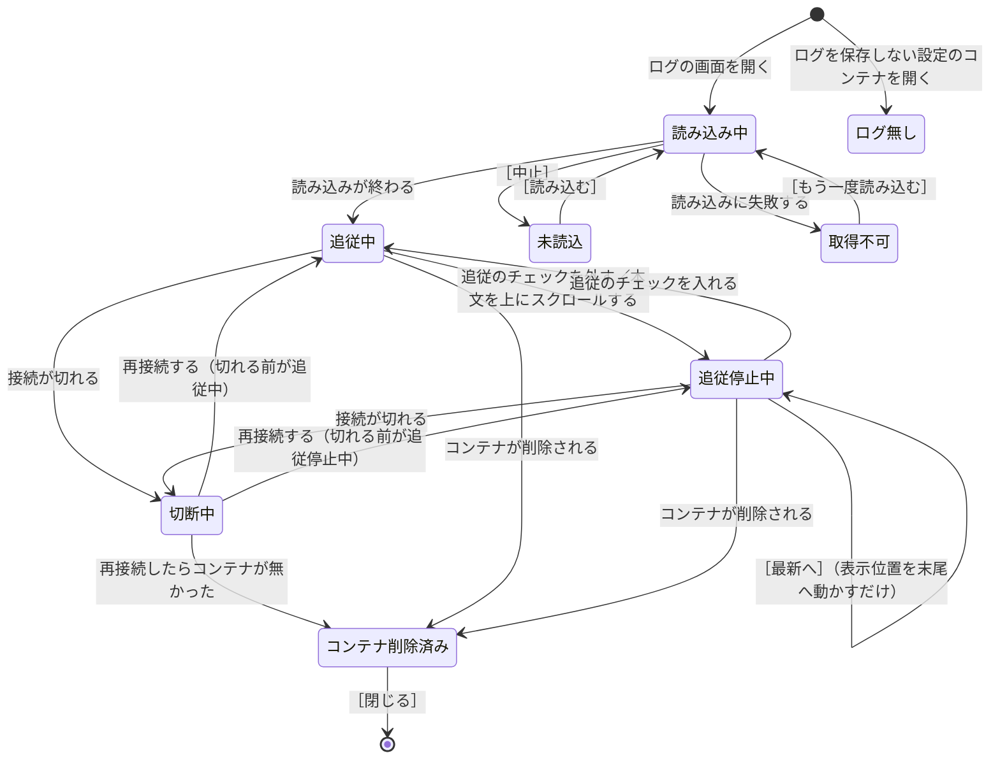

# 仕様: ログ

`common.md` の約束を前提にする。

## 開き方

コンテナの一覧の行から開く。**どの状態のコンテナでも開ける**（`containers.md`）。

ログの画面は同時に複数開ける。開いた画面の数だけ、エンジンとの通信路が増える。

## 画面の構成

画面を 3 つの部分に分ける。

```
          ┌─────────────────────────────────┐
見出し    │ web-1   [x] 追従   [x] 時刻   [絞り込み      ]        ［保存］   │
          ├─────────────────────────────────┤
状態の行  │ 新しい行が届いています                            ［最新へ］     │
          ├─────────────────────────────────┤
本文      │ 2026-09-17 10:02:41.220  Listening on port 3000                  │
          │ 2026-09-17 10:02:41.318  GET / 200                               │
          │ ...                                                              │
          └─────────────────────────────────┘
```

| 部分 | 位置 | 出すもの |
| --- | --- | --- |
| 見出し | 一番上 | コンテナの名前、追従の入切、時刻の入切、絞り込みの入力、［保存］ |
| 状態の行 | 見出しの下 | 状態に応じた文とボタン |
| 本文 | 状態の行の下 | ログの行と、省略の知らせ |

**状態の行は、高さを常に確保する。** 出すものが無い状態では、空のまま置く。

**why: 出たり消えたりして高さが変わると、本文の位置が動き、読んでいる行を見失う。**
本文に重ねる方法では高さは変わらないが、**重なった行が読めなくなる。**
高さを確保しておけば、本文が動くことも隠れることもない。

**［保存］は「ログ無し」と「取得不可」では押せない状態にする。**

## 画面の状態

| 状態 | 本文 | 状態の行に出す文 | ボタン |
| --- | --- | --- | --- |
| 読み込み中 | 空 | `web-1 のログを読み込んでいます… 経過 00:02` | ［中止］ |
| 未読込 | 空 | `web-1 のログを読み込んでいません` | ［読み込む］ |
| 追従中 | 新しい行が届くと末尾まで表示が進む | 空のまま | 無し |
| 追従停止中 | 新しい行は保持するが、表示は進めない | `新しい行が届いています` | ［最新へ］ |
| ログ無し | 空 | `web-1 はログを保存していません（--log-driver none）` | 無し |
| 取得不可 | 空 | `web-1 のログを取得できません（ログのドライバが読み取りに対応していません）` | ［もう一度読み込む］ |
| 切断中 | それまでの行を残す | `Docker との接続が切れました。再接続を待っています` | 無し |
| コンテナ削除済み | それまでの行を残す | `web-1 は削除されました` | ［閉じる］ |

**「コンテナ削除済み」で本文を残す why: 削除の直前に出ていた内容を読みたい場面がある。**
本文を消すと、読む前に消える。

### 状態の移り変わり



**「未読込」になるのは、読み込みを中止したときだけ。**
ログの画面を開くと「読み込み中」から始まるので、ほかに入り口が無い。

**「ログ無し」からはどこへも移らない。** コンテナの設定を変えない限り状態が変わらないため、
利用者は画面を閉じることになる。

**「切断中」にボタンを置かない。** 再接続の操作は状態バーで行う（`connection.md`）。
ログの画面に同じボタンを置くと、押せる場所が 2 つに分かれる。

**再接続したら、切れる前の状態に戻る。** 追従を止めていた利用者が、
再接続をきっかけに追従を始めると、読んでいた位置が末尾へ動く。

### ［中止］を押した後の状態

| 中止した処理 | 中止した後の状態 |
| --- | --- |
| 読み込み中 | 未読込（［読み込む］が出る） |
| 省略の知らせの読込中 | 未読込（［読み込む］が出る） |
| 保存中 | 中止する前の状態に戻る |

**中止した後は「取得不可」にしない。**

**why: 中止は失敗ではない**（`connection.md` と同じ扱い）。
「取得不可」は DockerGUI が試したうえで失敗した状態で、原因を出す。
中止した利用者に原因を出しても、読むものが無い。もう一度実行できる状態に戻す。

待たせるときの表示の並びは `common.md` に従う。

## 開いた直後に読み込む行数

**末尾の 1000 行だけを読み込む。** 行数は設定で変えられる。

**why: エンジンは、行数を指定しないとログ全体を返す。**
長く動いているコンテナのログは大きく、全体を読むと開くまで待たされる。

## 出す内容

**1 行につき、時刻と本文を出す。** 時刻は年月日と時分秒（`common.md` の表記）。

**標準出力の行と標準エラー出力の行を、見た目で区別する。**

**why: エラーの行を探すために開く場面が多い。** ただし、**エラーを標準出力に書くプログラムは多い。**
標準エラー出力として区別されていない行にエラーが含まれることがあるため、
**標準出力か標準エラー出力かで絞り込ませない。** 絞り込みは文字で行う。

## 絞り込み

入力した文字を含む行だけを画面に出す。大文字と小文字は区別しない。

**絞り込みの対象は、画面が保持している行だけ。エンジンから取り直さない。**

**why: 取り直すとログ全体を読むことになる。** 長く動いているコンテナのログは大きく、
文字を 1 文字入力するたびに全体を読み直すと、入力のたびに待たされる。
画面が保持していない古い行を対象にしたい利用者は、ファイルに保存して調べる。

**絞り込んでいる間も、新しい行を受け取り続ける。**
条件に合わない行も捨てずに保持するので、**絞り込みを解除すると、絞っている間の行も読める。**

**絞り込んでいる間も追従する。** 条件に合う行が届いたら、末尾まで表示を進める。

絞り込みの入力は、**ログの画面を閉じるまで残る。**

正規表現は対象にしない。入力した文字を含むかどうかだけで判定する。

## 追従

既定では追従する。

### 切り替え方

| 操作 | 切り替わり先 |
| --- | --- |
| 見出しの「追従」のチェックを外す | 追従停止中 |
| 本文を上にスクロールする | 追従停止中 |
| 見出しの「追従」のチェックを入れる | 追従中（表示位置も末尾へ動かす） |
| ［最新へ］を押す | **追従停止中のまま。表示位置を末尾へ動かすだけ** |

**チェックとスクロールは、同じ 1 つの状態を切り替える。**
上にスクロールしたら、見出しのチェックも自動で外れる。

**why: チェックと実際の動きが食い違うと、利用者はどちらを信じるか分からない。**
チェックが入ったまま表示が進まない状態を作らない。

**チェックを置く why: スクロールだけだと、意図して止める手段が見つからない。**
流れているログを読みたい利用者が、止め方を探すことになる。

### 追従停止中も、新しい行は受け取って保持する

**追従停止中に止めるのは、表示位置を末尾へ動かすことだけ。**
新しい行は受け取り続け、本文に足していく。**利用者が見ている位置は動かさない。**

**why: 受け取りを止めると、再開するときにエンジンから取り直すことになり、待ち時間が出る。**
受け取り続ければ、［最新へ］も追従の再開も、表示位置を動かすだけで済む。

保持する行数が上限を超えたら、古い行から捨てて省略の知らせを差し込む（「行数の上限」）。

**［最新へ］は追従を再開しない。表示位置を末尾へ動かすだけ。**

**why: 追従の入切は見出しのチェックで行う。**
［最新へ］でも切り替わると、チェックが利用者の操作なしに変わることになる。
末尾を一度だけ見たい利用者は、追従を止めたまま ［最新へ］ を押す。

## 省略の知らせ

**画面に出していないログの行があることを伝える、本文の中の 1 行を「省略の知らせ」と呼ぶ。**
アイコンではなく、本文の幅いっぱいに出す 1 行。

```
2026-09-17 10:02:41.318  GET / 200
--- 1820 行を省略（10:02:41 〜 10:02:43）［読み込む］---
2026-09-17 10:02:43.010  GET /health 200
```

ログの行を画面に出せない場面は 3 つある。

| 場面 | 画面に出せない理由 |
| --- | --- |
| 追い付かない | 画面が追い付かず、DockerGUI が行を捨てた（設計方針の原則 7） |
| 切り捨て | 保持する行数の上限を超えて、古い行を捨てた |
| 切断 | 接続が切れて、ログの通信路も切れた（`connection.md`） |

**どの場面でも、省略の知らせの状態と操作は同じ。**

| 省略の知らせの状態 | 表示する内容 | ボタン |
| --- | --- | --- |
| 未読込 | 出していない行数（分かる場合）と、出していない区間の時刻の範囲 | ［読み込む］ |
| 読込中 | 読み込んでいること、経過した時間 | ［中止］ |
| 失敗 | 読み込めなかった原因 | ［もう一度読み込む］ |

```
--- 1820 行を省略（10:02:41 〜 10:02:43）［読み込む］---
--- 1820 行を読み込んでいます… 経過 00:01 ［中止］---
--- 読み込めませんでした（エンジンにログが残っていません）［もう一度読み込む］---
--- 接続が切れました（10:05:12 〜 10:05:30）［読み込む］---
```

**読み込みに成功すると、省略の知らせが消えて、省略の知らせがあった場所にログが差し込まれる。**
前後の行と地続きになり、省略があったという表示は残らない。

**why: 省略の知らせを出す目的は、出していない行があることを隠さないこと。**
埋まった後も省略の知らせを残すと、読む人は埋まっていない区間があると考える。折りたたんで隠せるようにもしない——
閉じた区間があると、読んでいる人が省略に気づけなくなる。

### 行数の上限

| 上限 | 既定 | 超えたとき |
| --- | --- | --- |
| 画面が保持する行数 | 10000 行 | 古い行から捨て、省略の知らせを差し込む |
| 1 つの省略の知らせで取り直す行数 | 5000 行 | 先頭の一部だけを差し込み、ファイルに保存するよう案内する |

どちらも設定で変えられる。

**why: 数万行を画面に差し込んでも読めないうえ、差し込む処理そのもので画面が固まる。**

## ログを保存していないコンテナ

**コンテナの設定を読んで判定する。** 取得の失敗から推測しない。

コンテナの設定のうち、ログのドライバを表す項目が `none` であれば、
エンジンはログを保持していない。

```
web-1 はログを保存していません（--log-driver none）
```

**画面は開けるが、本文は空になる。** 保存のボタンは押せない状態にする。

**why: 開けないようにすると、利用者は DockerGUI の不具合だと考える。**
ログが無い理由を出せば、コンテナの起動の設定を見直すという次の行動につながる。

## 取得できないコンテナ

ログのドライバが `none` 以外でも、**読み取りに対応していないドライバがある。**
対応していないドライバのコンテナからログを取得すると、エンジンが失敗を返す。

```
web-1 のログを取得できません（ログのドライバが読み取りに対応していません）
```

**why: `none` は設定を読めば分かるが、読み取りに対応しているかどうかは設定から分からない。**
取得を試みて失敗したときにだけ、「取得不可」になる。

## ファイルに保存

［保存］を押すと、**ダイアログを出さずに、すぐ書き出しを始める。**

**why: ログの保存は、不具合を調べている最中に繰り返す操作。**
そのたびに保存先とファイル名を決めると、手数が毎回かかる。
書き出したファイルは、保存先を表示して ［フォルダを開く］ を置けば見つけられる。

| 項目 | 決め方 |
| --- | --- |
| 保存先 | 設定の「ログの保存先」。既定は OS のダウンロードの場所 |
| ファイル名 | コンテナの名前と、保存を始めた日時（例: `web-1-20260917-100512.log`） |
| 同じ名前のファイルがある場合 | **上書きしない。** 名前の末尾に連番を付ける（`…-2.log`） |

**上書きしない why: ダイアログを出さないので、上書きの確認を出す相手がいない。**
黙って上書きすると、前に保存したログが消える。

**保存中は ［保存］ を押せない状態にする。** 同じログを同時に 2 つ書き出す意味が無い。

### 保存の状態

保存は本文の表示に影響しないため、**状態の行をもう 1 行増やして出す。**

| 保存の状態 | 状態の行に出す文 | ボタン |
| --- | --- | --- |
| 保存中 | `web-1-20260917-100512.log に保存しています… 1820 行  経過 00:03` | ［中止］ |
| 保存済み | `web-1-20260917-100512.log に保存しました（18200 行）` | ［フォルダを開く］［閉じる］ |
| 保存失敗 | `保存できませんでした（書き込む場所がありません）` | ［もう一度保存する］［閉じる］ |

**「保存済み」と「保存失敗」は、利用者が ［閉じる］ を押すまで残す。**

**why: 保存が終わったことを自動で消すと、席を外していた利用者は結果を知れない**（`common.md`）。

**保存を中止した場合、書きかけのファイルを消さずに残す。**
ファイルの末尾に、中止した時刻と、そこまでに書いた行数を書き足す。

```
--- 1820 行を保存した時点で中止しました（2026-09-17 10:05:12）---
```

**why: 途中まででも読みたい場面がある。** 消すと、待った時間から利用者が何も得られない。
ただし、書きかけであることがファイルから読み取れないと、
利用者は全部が保存されたと考える。**末尾に書き足して、途中であることを残す。**

### 保存は画面を経由しない

**保存は main の中で完結する。**

**why: 画面を経由しないため、背圧も省略も起きない**（設計方針の原則 7）。
追い切れない量のログは、画面で読むものではなくファイルで読むもの。
