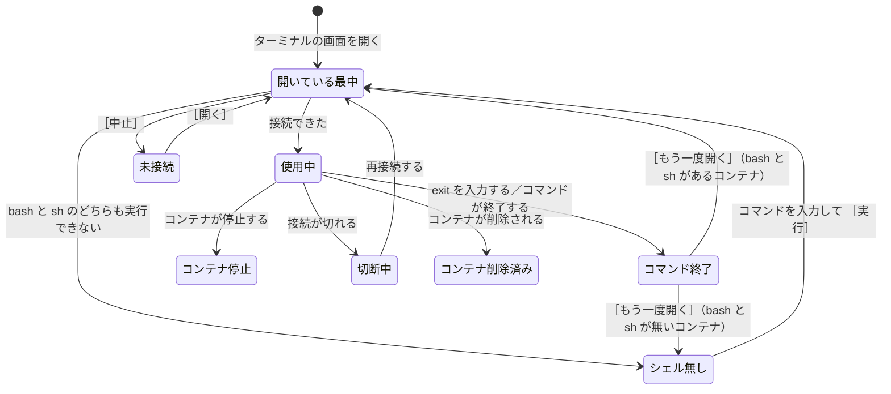

# 仕様: ターミナル

`common.md` の約束を前提にする。

## 開き方

コンテナの一覧の行から開く。**動作中のコンテナでだけ開ける**（`containers.md`）。

ターミナルの画面は同時に複数開ける。開いた画面の数だけ、エンジンとの通信路が増える。

## 実行するコマンド

**`bash` があれば `bash`、無ければ `sh` で開く。**

**why: 小さいイメージには `bash` が入っていない。** `alpine` を元にしたイメージには
`sh` しか無いことが多い。`bash` を決め打ちにすると、開けないコンテナが多く出る。

**どちらを使うかは、コンテナの中のシェルに判定させる。**
DockerGUI が `bash` を試して失敗を見てから `sh` を試す、という順序では実行しない。

**why: 失敗の形（返る文と終了コード）はエンジンの版によって変わりうる。**
失敗の文を読んで判断すると、版が変わったときに判定が外れる。
シェルに判定させれば、DockerGUI は失敗の形を解釈しなくて済む。

`sh` も無いコンテナでは開けない。**実行するコマンドを利用者が入力する。**

入力欄は状態の行に置き、ボタンは ［実行］ にする。**本文に直接入力させない。**

**why: 「シェル無し」では、繋がっている相手がいない。**
本文は繋がった相手の出力を映す場所なので、入力を受けても送り先が無い。
本文に入力させるには、文字の編集（カーソルの移動、削除、貼り付け）を
DockerGUI が自前で作ることになる。入力欄なら OS の機能をそのまま使える。

加えて、本文にプロンプトを出すと、**利用者はすでにコンテナの中のシェルに繋がっていると考える。**

ボタンを ［開く］ にしない。

**why: 利用者が入力するのはコマンドで、押した結果に起きるのはコマンドの実行。**
入力したものが `ls` なら、実行して終了するだけでターミナルとして使えるとは限らない。
「未接続」の ［開く］ は既定のシェルで開く操作で、動きが違う。同じ名前にすると読み分けられない。

## 画面の構成

画面を 3 つの部分に分ける。

```
          ┌─────────────────────────────────┐
見出し    │ web-1   bash                                        ［閉じる］   │
          ├─────────────────────────────────┤
状態の行  │ コマンドが終了しました              ［もう一度開く］［閉じる］   │
          ├─────────────────────────────────┤
本文      │ # ls                                                             │
          │ app  node_modules  package.json                                  │
          │ # _                                                              │
          └─────────────────────────────────┘
```

| 部分 | 位置 | 出すもの |
| --- | --- | --- |
| 見出し | 一番上 | コンテナの名前、実行しているコマンド、［閉じる］ |
| 状態の行 | 見出しの下 | 状態に応じた文とボタン |
| 本文 | 状態の行の下 | ターミナルの表示 |

**状態の行は、高さを常に確保する。** 出すものが無い状態では、空のまま置く。

**why: 出たり消えたりして高さが変わると、ターミナルの行数が変わる。**
行数が変わるたびにエンジンへ大きさを送り直すことになり、
コンテナの中のプログラムが描き直される。

**見出しに、実行しているコマンドを出す。**

**why: `bash` と `sh` のどちらで開いたかで、使える機能が違う。**
補完や履歴が効かないときに、利用者が理由を確かめられる。

## 画面の状態

| 状態 | 本文 | 状態の行に出す文 | ボタン |
| --- | --- | --- | --- |
| 開いている最中 | 受け取った出力を残す | `web-1 でターミナルを開いています… 経過 00:02` | ［中止］ |
| 未接続 | 受け取った出力を残す | `web-1 でターミナルを開いていません` | ［開く］ |
| 使用中 | 入力と出力ができる | 空のまま | 無し（見出しの ［閉じる］ は押せる） |
| コマンド終了 | 受け取った出力を残す | `コマンドが終了しました` | ［もう一度開く］［閉じる］ |
| シェル無し | 受け取った出力を残す | `bash と sh のどちらも実行できません。コンテナの中で実行するコマンドを入力してください` と、入力欄 | ［実行］［閉じる］ |
| コンテナ停止 | 受け取った出力を残す | `web-1 が停止したため、ターミナルが終了しました` | ［閉じる］ |
| 切断中 | 受け取った出力を残す | `Docker との接続が切れました。再接続を待っています` | 無し（見出しの ［閉じる］ は押せる） |
| コンテナ削除済み | 受け取った出力を残す | `web-1 は削除されました` | ［閉じる］ |

### 状態の移り変わり



**［閉じる］は、どの状態でも押せる。** 見出しにあり、状態によって消えない。
状態遷移図には書いていない——すべての状態から終了へ矢印が出て、図が読めなくなるため。

**「使用中」でも押せる。** `exit` を入力しなくてもターミナルの画面を閉じられる。

### 出力は消さない

**一度でも受け取った出力は、ターミナルの画面を閉じるまで本文に残す。**
もう一度開いても、再接続しても、それまでの出力は消さない。

**新しく開いたセッションの出力は、区切りの行を挟んで下に続ける。**

```
$ exit
--- コマンドが終了しました（10:05:12）---
--- 新しいターミナルを開きました（10:05:20）---
# _
```

**why: 出力を残す目的は、終了の直前に何が出ていたかを読むこと。**
もう一度開いた時点で消すと、読む前に消える。
区切りの行を入れるのは、**前のセッションの出力と混ざって見えないようにするため。**

### 再接続しても、切れる前の状態には戻らない

**「開いている最中」から始め直す。**

**why: 接続が切れた時点で、コンテナの中で実行していたコマンドは終わっている。**
再接続した後の通信路は別のものなので、続きを実行できない。

**「切断中」にボタンを置かない。** 再接続の操作は状態バーで行う（`connection.md`）。

### ［中止］を押した後の状態

「開いている最中」で ［中止］ を押すと、**「未接続」になる。**
［開く］ を押せば、もう一度開ける。

**why: 中止は失敗ではない**（`connection.md` と同じ扱い）。
画面ごと閉じると、利用者はコンテナの一覧に戻って開き直すことになる。

## 入力と出力

- 利用者の入力をコンテナへ送り、コンテナの出力を本文に出す
- ターミナルの制御文字（色、カーソルの移動、画面の消去）を解釈して表示する
- 文字の符号化は UTF-8 として扱う

### キーはコンテナへ送る

**DockerGUI はキーを横取りしない。** `Ctrl+C` `Ctrl+D` `Ctrl+Z` や矢印キーは、
すべてコンテナへ送る。

**why: ターミナルで作業する利用者は、コンテナの中のプログラムへキーを送るために開いている。**
DockerGUI が横取りすると、動いているプログラムを止められなくなる。

**例外はコピーと貼り付けだけ。**

| OS | コピー | 貼り付け |
| --- | --- | --- |
| macOS | `Cmd + C` | `Cmd + V` |
| Windows | `Ctrl + Shift + C` | `Ctrl + Shift + V` |

**why: Windows の `Ctrl + C` はコンテナへ送る必要がある。**
コピーに使うと、動いているプログラムを止められなくなる。
`Shift` を足した組み合わせは、ターミナルのアプリで広く使われている。

**画面を閉じるキーは置かない。** `Esc` も `Ctrl + W` もコンテナの中で使うため、
閉じる操作は ［閉じる］ のボタンだけにする。

### 複数行の貼り付け

**複数行を貼り付けるときは、実行の前に確認を出す。**

```
3 行を貼り付けます。改行ごとにコマンドとして実行されます。
              [ やめる ]  [ 貼り付ける ]
```

**why: 末尾に改行が含まれていると、利用者が内容を確かめる前に最後のコマンドまで実行される。**

## 画面の大きさを変えたとき

**本文の行数と桁数が変わったら、新しい値をエンジンへ送る。**

**why: 送らないと、コンテナの中のプログラムは古い大きさのまま描画する。**
`vi` のような画面を描くプログラムで、表示が崩れる。

**送るのは、大きさが変わり終わってから。** 変えている最中は送らない。

**why: 画面の端をつかんで動かしている間、大きさは連続して変わる。**
変わるたびに送ると、要求が短い間隔で大量に並ぶ。

## 閉じたとき

［閉じる］を押すか画面を閉じると、**コンテナの中で実行しているコマンドを終了させ、
エンジンとの通信路を閉じる。**

**why: 閉じないと、コンテナの中のコマンドが動き続け、通信路のための子プロセスも残る**
（設計方針の原則 8）。

**閉じてもコンテナは止まらない。** 終わるのは、ターミナルで実行していたコマンドだけ。

### 閉じるときに確認を出さない

**コンテナの中で実行中のプログラムがあっても、確認を出さない。**

**why: DockerGUI からは、シェルの中で何が動いているかが分からない。**
判定できない条件で確認を出すと、毎回出すか一度も出さないかになる。
毎回出すと、閉じるたびに 1 回押す操作が増える。

## コマンドが終了したとき

利用者が `exit` を入力した場合と、実行していたコマンドが自分で終了した場合。

**受け取った出力を残し、「コマンド終了」の状態にする。**
［もう一度開く］ を押すと、同じコンテナで新しいセッションを開き、出力を下に続ける。

**`bash` と `sh` が無いコンテナでは、［もう一度開く］ は「シェル無し」に戻る。**

**why: もう一度 `bash` と `sh` を試しても、同じ理由で失敗する。**
失敗を待たせてから入力欄を出すより、入力欄を先に出すほうが早い。

**why: 打ち間違いで `exit` を入力することがある。**
画面ごと閉じると、コンテナの一覧に戻って開き直すことになる。
終了の直前に出ていた出力も、画面ごと閉じると読む前に消える。
